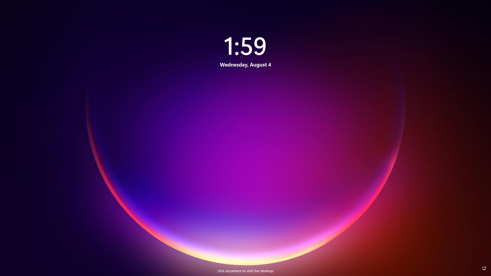

# 🔆 Solar

Welcome to Solar! Solar is a Windows 11 recreation in [Svelte](https://svelte.dev) using [Routify](https://routify.dev).

**Solar is currently not finished, so anything you see here is not the final product.**

## 🛠️ Building

You need [node.js](https://nodejs.org/en/download/) in order to run this project. 

Run the command `npm install`, then `npm run dev` to run a development session. If you want to build it, run `npm run build`.

## 📸 Screenshots

- <h3>Lock screen</h3>
  

- <h3>Desktop</h3>
  

## 🆕 Create an app

To read more about how to create an app, see the [docs](/docs/WindowOptions.md).